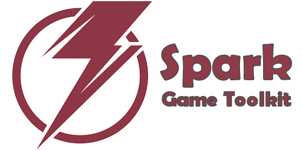

<a href="https://tinybiggames.com" target="_blank"></a>

[](https://discord.gg/tPWjMwK) [](https://github.com/tinyBigGAMES/SparkGameToolkit/stargazers) [](https://github.com/tinyBigGAMES/SparkGameToolkit/network/members) [](https://github.com/tinyBigGAMES/SparkGameToolkit/network/members)
[](https://twitter.com/tinyBigGAMES)

## Overview
Spark Game Toolkit&trade; is a 2D professional indie game library that allows you to do game development in <a href="https://www.embarcadero.com/products/delphi" target="_blank">Delphi</a> for desktop PC's running Microsoft Windows® and uses OpenGL® for hardware accelerated rendering.

It's robust, designed for easy use and suitable for making all types of 2D games and other graphic simulations, You access the features from a simple and intuitive API, to allow you to rapidly and efficiently develop your projects. There is support for bitmaps, audio samples, streaming music, video playback, loading resources directly from a compressed and encrypted archive, collision detection and much more.

Spark Game Toolkit, easy game programming for Delphi!

## Downloads
<a href="https://github.com/tinyBigGAMES/SparkGameToolkit/archive/refs/heads/main.zip" target="_blank">**Development**</a> - This build represents the most recent development state an as such may or may not be as stable as the official release versions. If you like living on the bleeding edge, it's updated frequently (often daily) and will contain bug fixes and new features.

<a href="https://github.com/tinyBigGAMES/SparkGameToolkit/releases" target="_blank">**Releases**</a> - These are the official release versions and deemed to be the most stable.

## Features
- **Free & open-source**. See <a href="https://github.com/tinyBigGAMES/SparkGameToolkit/blob/main/LICENSE" target="_blank">License agreement</a>.
- Written in **Object Pascal**
- Support Windows 64 bit platform
- Hardware accelerated with **OpenGL**
- Built on top of <a href="https://github.com/liballeg/allegro5" target="_blank">Allegro</a>
- You interact with Spark via your derived `TGame` class and the various classes and routines in the `Spark` unit.
- **Archive** (custom archive format, password protection)
- **Window** (OpenGL, anti-aliasing, vsync, viewports, primitives, blending)
- **Input** (keyboard, mouse and joystick)
- **Texture** (color key transparency, scaling, rotation, flipped, titled,  BMP, DDS, PCX, TGA, JPEG, PNG)
- **Video** (play, pause, rewind, OGV format)
- **Sprite** (pages, groups, animation, poly-point collision)
- **Entity** (defined from a sprite, position, scale, rotation, collision)
- **Audio** (samples, streams, WAV, OGG/Vorbis, FLAC formats)
- **Font** (true type, scale, rotate)
- **Timing** (time-based, frame elapsed, frame speed)
- **Shaders** (vertex, fragment, GLSL)
- **Misc** (collision, easing, screen shake, screenshot, starfield, colors, INI based config files, startup dialog, treeview menu)

## Minimum System Requirements
- Any Delphi version with Unicode, advanced records and Win64 support
- Microsoft Windows 8.1, 64 bits
- OpenGL 3

## How to use in Delphi
- Unzip the archive to a desired location.
- Add `installdir\sources`, folder to Delphi's library path so the toolkit source files can be found for any project or for a specific project add to its search path.
- In Delphi, load `Spark Game Toolkit.groupproj` to load and compile the project files.
- Compile and use `ZipArc` utility for making archive files (standard password protected zip format). Running the `makearc.bat` in `installdir\bin` will build `Data.arc` that is used by the examples.
- Compile and run the various examples which will showcase the toolkit features and how to use them.
- See examples in the `installdir\examples` for more information about usage.
- You must include `Spark.dll` in your project distribution.
- See `installdir\docs` folder for documentation.

## Known Issues
- This project is in active development so changes will be frequent 
- Documentation is WIP. They will continue to evolve
- More examples will continually be added over time
- When you run the font example it will seem like it is hung, give it a moment and it will startup. The mono.ttf used in the example has a very large number of glyphs which we use for testing unicode support. We will continue to investigate this.

## A Tour of Spark Game Toolkit
### Game Object
You just have to derive a new class from the `TGame` base class and override a few callback methods. You access the toolkit functionality from the `Spark` unit.
```pascal
uses
  Spark;

type
  { TMyGame }
  TMyGame = class(TGame)
  public
    procedure OnSetSettings(var aSettings: TGameSettings); override;
    procedure OnStartup; override;
    procedure OnShutdown; override;
    procedure OnUpdate(aDeltaTime: Double); override;
    procedure OnRender; override;
    procedure OnRendeHUD; override;
  end;
```
### How to use
A minimal implementation example:
```pascal

{ TMyGame }
procedure TMyGame.OnSetSettings(var aSettings: TGameSettings);
begin
  inherited;
  
  // add your settings code  
  aSettings.WindowWidth := 960;
  aSettings.WindowHeight := 540;
  aSettings.WindowTitle := 'My Game';
  aSettings.WindowClearColor := DARKSLATEBROWN;  
end;

procedure TMyGame.OnStartup;
begin
  inherited;
  
  // add your own startup code
end;

procedure TMyGame.OnShutdown;
begin
  // add your shutdown code
  
  inherited;
end;

procedure TMyGame.OnUpdate(aDeltaTime: Double);
begin
  inherited;
  
  // add your update code
end;

procedure TMyGame.OnRender;
begin
  inherited;
  
  // render your render code
end;

procedure TMyGame.OnRenderHUD;
begin
  inherited;
  
  // add your render HUD code 
end;
```
To run your game, call
```pascal
RunGame(TMyGame);
```
**NOTE:** For a Spark game to work properly, execution MUST start with `RunGame(...)`.

See the examples for more information on usage.

## Media


## Support
- <a href="https://github.com/tinyBigGAMES/SparkGameToolkit/issues" target="_blank">Issue Tracking</a>
- <a href="https://github.com/tinyBigGAMES/SparkGameToolkit/discussions" target="_blank">Discussions</a>
- <a href="https://tinybiggames.com" target="_blank">Website</a>
- <a href="mailto:support@tinybiggames.com" target="_blank">Email</a>
- <a href="https://discord.gg/tPWjMwK" target="_blank">Discord</a>


<p align="center">
 <a href="https://www.embarcadero.com/products/delphi" target="_blank"></a><br/>
 ♥ <b>Made for Delphi</b>
</p>